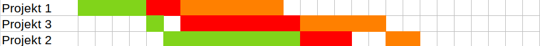

# Czym jest problem szeregowania?

Jest to jeden z najbardziej znanych problemów optymalizacji. Był pierwszym dla
którego analiza kompetytywna została zaprezentowana [@graham_1966].
Najefektywniejszy algorytm znany obecnie [@fleischer_2000] jest 
1.9201-kompetytywny dla liczby ekip $m\geq 64$, jest to algorytm online.

Analiza kompetytywna

: polega na wyznaczeniu prędkości algorytmu w porównaniu do algorytmu
  wyznaczającego rozwiązanie optymalne. Stosowana jest dla algorytmów online

Algorytm online

: nie przyjmują wszystkich danych "na raz"

Algorytm offline

: przyjmuje dane "od razu"

Problem szeregowania jest problemem NP-zupełnym i NP-trudnym, co oznacza, że
wyznaczenie rozwiązania optymalnego jest niemożliwe w czasie wielomianowym,
jeśli $P \neq NP$, jednak nie ma aktualnie dowodu potwierdzającego ani
zaprzeczającego, że te dwie klasy problemów są tożsame.

# Algorytm Browna-Łomnickiego

Algorytm Browna-Łomnickiego [@brown_1966] jest to uogólniona wersja algorytmu
Łomnickiego zaprezentowana rok po oryginale [@lomnicki_1965]. Opiera się on na
zasadzie "Branch & Bound", która jest stosowana w problemie komiwojażera. Jest
to metoda dająca rozwiązanie optymalne. Algorytm ten wymaga, aby wszystkie
zadania były wykonywane w tej samej kolejności przez każdy zespół (więc nie
nadaje się do jednej z częstych generalizacji o dowolnej kolejności zadań).
Zadania wykonywane przez kolejne zespoły są wykonywane nieprzerwanie, tj. po
rozpoczęciu zadania trwa ono aż do swojego końca.

Nasza implementacja zainspirowana została zainspirowana przez pracę z
Uniwersytetu Warszawskiego [@nowak_2010] w której pokazane zostało zastosowanie
dla algorytmu Browna-Łomnickiego w budownictwie, a pierwotna implementacja
została napisana w Javie. Nasza wersja bazuje na Pythonie 3.9.

## Zadanie przykładowe

W firmie Obrabiarex sp. z o. o. przyjęte zostały trzy zlecenia, które wymagają
użycia trzech różnych procesów technologicznych. Ze względu na specyfikę ich
pracy znane są potrzebne czasy do wykonania każdego projektu na każdej maszynie.
Niestety firma Obrabiarex jest nowa na rynku i ma jedynie po jednym stanowisku
do każdego z procesów technologicznych
W [tabeli @tbl:koszty1] zaprezentowano czasy pracy nad każdym elementem na każdej
maszynie.

| Maszyna    | Projekt 1 | Projekt 2 | Projekt 3 |
|-----------:|:---------:|:---------:|:---------:|
| Tokarka    | 4         | 8         | 1         |
| Skrawarka  | 2         | 3         | 7         |
| Anodyzacja | 6         | 2         | 5         |
Table: Czas potrzebny na wykonanie każdego z projektu w godzinach. {#tbl:koszty1}

Najpierw zwizualizowany został ile czasu jest wymagane, aby ukończyć projekty w
kolejności ich przydzielenia.

{#fig:gantt1}

Jak widać na [rysunku @fig:gantt1] przerwy między zadaniami okazują się znaczące,
co na pewno nie pomaga w optymalności uszeregowania zadań.

{#fig:gantt2}

Na [rysunku @fig:gantt2] przestawione zostały wiersze projektu 2 i projektu 3 w
celu poprawienia czytelności, a także pozostawiono "pustą" komórkę, która
została "zaoszczędzona" dzięki zoptymalizowaniu uszeregowania.

# Bibliografia
