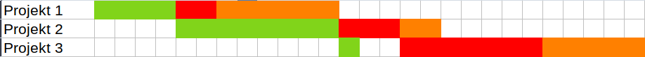
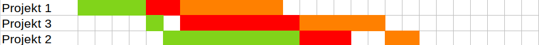

# Czym jest problem szeregowania?

Jest to jeden z najbardziej znanych problemów optymalizacji. Był pierwszym, dla
którego analiza kompetytywna została zaprezentowana [@graham_1966].
Najefektywniejszy algorytm znany obecnie [@fleischer_2000] jest 
1.9201-kompetytywny dla liczby ekip $m\geq 64$, jest to algorytm online.

Analiza kompetytywna

: polega na wyznaczeniu prędkości algorytmu w porównaniu do algorytmu
  wyznaczającego rozwiązanie optymalne. Stosowana jest dla algorytmów online

Algorytm online

: nie przyjmują wszystkich danych "na raz"

Algorytm offline

: przyjmuje dane "od razu"

Problem szeregowania jest problemem NP-zupełnym i NP-trudnym, co oznacza, że
wyznaczenie rozwiązania optymalnego jest niemożliwe w czasie wielomianowym,
jeśli $P \neq NP$, jednak nie ma aktualnie dowodu potwierdzającego ani
zaprzeczającego, że te dwie klasy problemów są tożsame.

# Algorytm Browna-Łomnickiego

Algorytm Browna-Łomnickiego [@brown_1966] jest to uogólniona wersja algorytmu
Łomnickiego zaprezentowana rok po oryginale [@lomnicki_1965]. Opiera się on na
zasadzie "Branch & Bound", która jest stosowana w problemie komiwojażera. Jest
to metoda dająca rozwiązanie optymalne. Algorytm ten wymaga, aby wszystkie
zadania były wykonywane w tej samej kolejności przez każdy zespół (więc nie
nadaje się do jednej z częstych generalizacji o dowolnej kolejności zadań).
Zadania wykonywane przez kolejne zespoły są wykonywane nieprzerwanie, tj. po
rozpoczęciu zadania trwa ono aż do swojego końca.

Nasza implementacja zainspirowana została zainspirowana przez pracę z
Uniwersytetu Warszawskiego [@nowak_2010] w której pokazane zostało zastosowanie
dla algorytmu Browna-Łomnickiego w budownictwie, a pierwotna implementacja
została napisana w Javie. Nasza wersja bazuje na Pythonie 3.9.

## Zadanie przykładowe

W firmie Obrabiarex sp. z o. o. przyjęte zostały trzy zlecenia, które wymagają
użycia trzech różnych procesów technologicznych. Ze względu na specyfikę ich
pracy znane są potrzebne czasy do wykonania każdego projektu na każdej maszynie.
Niestety firma Obrabiarex jest nowa na rynku i ma jedynie po jednym stanowisku
do każdego z procesów technologicznych
W [tabeli @tbl:koszty1] zaprezentowano czasy pracy nad każdym elementem na każdej
maszynie.

| Maszyna    | Projekt 1 | Projekt 2 | Projekt 3 |
|-----------:|:---------:|:---------:|:---------:|
| Tokarka    | 4         | 8         | 1         |
| Skrawarka  | 2         | 3         | 7         |
| Anodyzacja | 6         | 2         | 5         |
Table: Czas potrzebny na wykonanie każdego z projektu w godzinach. {#tbl:koszty1}

Najpierw zwizualizowane zostało, ile czasu jest wymagane, aby ukończyć projekty w
kolejności ich przydzielenia.

{#fig:gantt1}

Jak widać na [rysunku @fig:gantt1] przerwy między zadaniami okazują się znaczące,
co na pewno nie pomaga w optymalności uszeregowania zadań. Czas takiego 
rozwiązania wynosi 27.

{#fig:gantt2}

Na [rysunku @fig:gantt2] przestawione zostały wiersze projektu 2 i projektu 3 w
celu poprawienia czytelności, a także pozostawiono „pustą” komórkę, która
została „zaoszczędzona” dzięki zoptymalizowaniu uszeregowania. Teraz koszt 
rozwiązania wyniosi 20.

### Rozwiązanie optymalne z pomocą algorytmu w Pythonie

```python
import numpy as np
from src.lomnicki import lomnicki

dane = np.array([
  [4, 8, 1],
  [2, 3, 7],
  [6, 2, 5]
])
print(lomnicki(dane))
```
Co dało następujący wynik:
```
([[0, 2, 1]], [20.0])
```
Gdzie pierwsza lista to lista list wszystkich permutacji optymalnych, a druga 
lista zawiera ich koszty (dla wszystkich są takie same). Ponieważ w pythonie 
indeksy numerowane są od 0, to tłumacząc to na numerację od 1, wynik jest taki
sam. Co oznacza, że rozwiązanie zaprezentowane na [rysunku @fig:gantt2] jest 
rozwiązaniem optymalnym.

# Rozwiązanie zadania „dużego”

Program został napisany w Pythonie 3 z wykorzystaniem biblioteki NumPy. Służy
ona do łatwych operacji na macierzach oraz przyspiesza obliczenia ze względu na
implementację niektórych funkcji w języku C.


Współczynniki wprowadzone do zadania dla algorytmu zostały wygenerowane losowo.
Zostały wprowadzone jako macierz.

## Przykład z macierzą (10,5)

```python
import numpy as np
from src.lomnicki import lomnicki

dane = np.random.randint(1, 15, size=(10, 5))
print(dane)
print(lomnicki(dane))
```
W naszym przypadku dało to następujący wynik, liczył się on 28ms.
```
# Macierz czasu wykonania
[[ 9  6  7 12 10]
 [ 2  9  9  5  1]
 [ 9 14 12 10  4]
 [ 1  6  9  8  8]
 [ 8 12 13  1  6]
 [11 12 11 12 12]
 [ 2  2  4  7  8]
 [ 4  1  6 10  3]
 [ 3 12  7  6 10]
 [10 12  1  3  2]]

# Rozwiązanie
([[0, 1, 3, 4, 2], [0, 3, 1, 4, 2], [0, 4, 1, 3, 2], 
  [3, 0, 1, 4, 2], [4, 0, 1, 3, 2], [4, 1, 3, 0, 2]], 
  [121.0, 121.0, 121.0, 121.0, 121.0, 121.0])
```

## Przykład z macierzą (8,10)

```python
import numpy as np
from src.lomnicki import lomnicki

dane = np.random.randint(1, 1000, size=(8, 10))
print(dane)
print(lomnicki(dane))
```
Algorytm działał przez 187ms i zwrócił wynik.
```
# Macierz czasu wykonania
[[428  74 316 396 816 557 893 446 971 613]
 [422 126  25 252 774 707 354  54 220 514]
 [672 154 322 431 550 279 329 672 426 360]
 [580 673 340 638  81 373 376 715 716  39]
 [967 524  83 871 967 833 176 578  73 307]
 [969 297 864 589 784 281 858 467 440 666]
 [ 11 353 691 852  85 282 701 712 120 844]
 [894 761 302 906 507 980 457 194 209 692]]
 
# Rozwiązanie
([[1, 2, 5, 9, 3, 6, 0, 7, 4, 8], [2, 1, 5, 9, 3, 6, 0, 7, 4, 8]], 
  [9076.0, 9076.0])
```

Z naszych testów wynika, że czas wyszukiwania rozwiązania w dużej mierze zależy
od warunków początkowych. Zdarzało się, że małe macierze (od 5 do 8 kolumn) 
obliczały się w kilka ms do kilku s i zdarzało się, że duże macierze (od 10 do
12 kolumn) obliczały się w kilka s zamiast minut.

# Bibliografia
